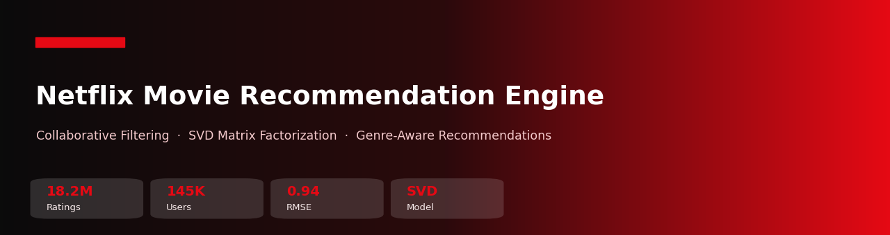
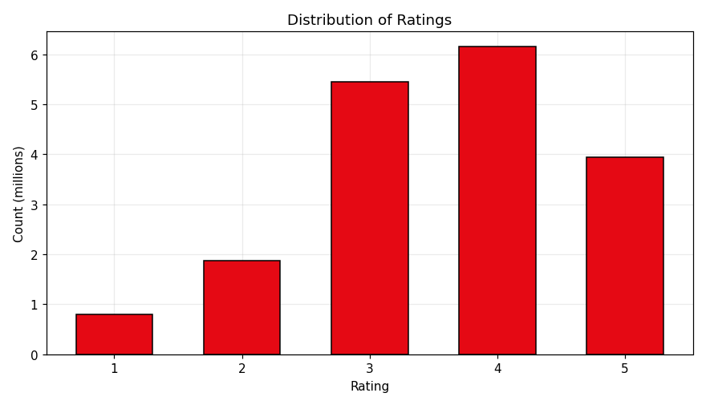
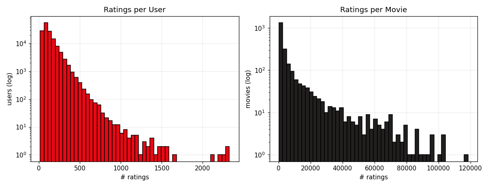
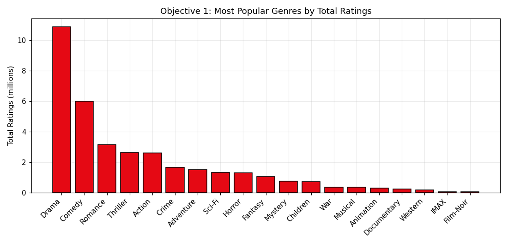
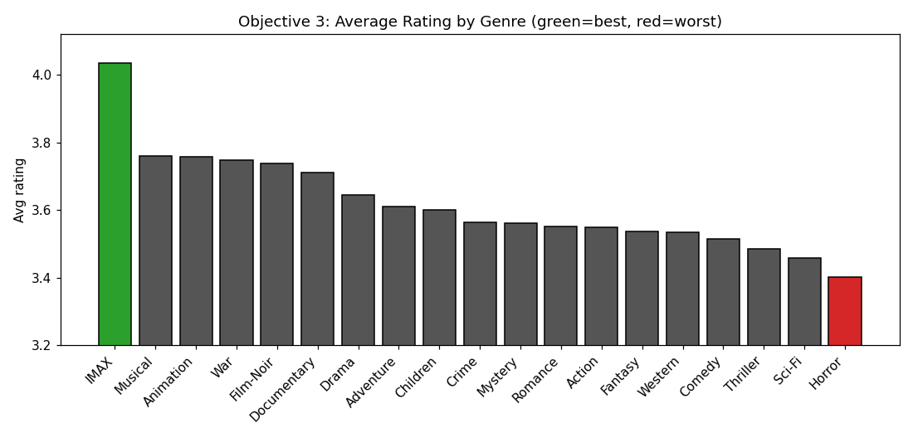

<div align="center">



# 🎬 Netflix Movie Recommendation Engine

#### Collaborative Filtering · SVD Matrix Factorization · Genre-Aware Recommendations

*Data Science Capstone — Intellipaat · Netflix Prize Dataset*

<br/>


<br/>

[](https://colab.research.google.com/github/AnkitSaxena-AI/Netflix-Recommendation-System/blob/main/Netflix_Recommendation_Engine.ipynb)
[](Netflix_Recommendation_Engine.ipynb)
[-EC1C24?style=for-the-badge&logo=adobeacrobatreader&logoColor=white)](reports/Netflix_Capstone_Report.pdf)

</div>

---

## 📑 Table of Contents

<a id="toc"></a>

- [🎯 Overview](#overview)
- [🧩 Problem Statement](#problem-statement)
- [🗃️ Dataset](#dataset)
- [🏷️ Genre Enrichment](#genres)
- [🛠️ Tech Stack](#tech-stack)
- [🗂️ Project Structure](#project-structure)
- [📊 EDA & Objectives](#eda)
- [🤖 The Model (SVD)](#model)
- [🚀 Getting Started](#getting-started)
- [👤 Author](#author)
- [📄 License](#license)

---

<a id="overview"></a>

## 🎯 Overview

A movie recommendation engine built from the ground up on the **Netflix Prize** dataset. It analyzes how users rate movies, enriches the data with **real genres**, and uses **SVD collaborative filtering** to predict ratings and generate **personalized, genre-aware recommendations**.

### ⭐ Key Results at a Glance

| Aspect | Result |
|---|---|
| 🤖 **Model** | Tuned **SVD** — **RMSE 0.9417** (beats Netflix's Cinematch baseline of 0.9514) |
| 📈 **Data** | 24M ratings → **18.2M** after filtering (145K users, 2,340 movies) |
| 🏷️ **Genres** | Enriched from **MovieLens** real genres (~63% of ratings) + keyword fallback |
| 🥇 **Most popular genre** | **Drama** (~10.9M ratings), then Comedy, Romance |
| ⭐ **Best-rated genre** | **IMAX** (4.04); **worst:** Horror (3.40) |

---

<a id="problem-statement"></a>

## 🧩 Problem Statement

> Recommendation engines predict user activity and suggest content that suits each user's taste. Build one from the ground up on the Netflix ratings data and answer:

1. **Find the most popular / liked genres.**
2. **Build a model that finds the best-suited movie per genre for a given user.**
3. **Find which genres receive the best and worst ratings.**

---

<a id="dataset"></a>

## 🗃️ Dataset

**Netflix Prize Dataset** — `combined_data_1.txt` (file 1 of 4) + `movie_titles.csv`.

| Field | Description |
|---|---|
| `Cust_Id` | Anonymous user ID |
| `Movie_Id` | Movie ID (from `n:` header rows in the raw file) |
| `Rating` | Integer rating 1–5 |
| `Name`, `Year` | Movie title and release year |

- **24.05M** ratings · **470,758** users · **4,499** movies (this file)
- Filtered (movies >500 ratings, users >50 ratings) → **18.2M** ratings · **145,664** users · **2,340** movies

> ⚠️ The full `combined_data_1.txt` (~470 MB) exceeds GitHub's file limit, so it's **not committed**. Download it from [Kaggle](https://www.kaggle.com/datasets/netflix-inc/netflix-prize-data) into `data/`. A **1M+ ratings sample** (`data/ratings_sample.csv`) is included so the notebook runs out-of-the-box.

---

<a id="genres"></a>

## 🏷️ Genre Enrichment (the key fix)

The Netflix Prize data has **no genre column** — yet every objective needs genres. Instead of guessing, each movie (title + year) is matched to the **MovieLens** genre database, with a keyword classifier as fallback for unmatched titles.

| Genre source | Share of movies | Share of ratings |
|---|:---:|:---:|
| **MovieLens (real genres)** | 47% | **63%** |
| Keyword fallback | 53% | 37% |

Because the popular, heavily-rated movies are mostly matched to **real** genres, ~63% of all ratings carry genuine genre labels — fixing the "everything becomes Drama" problem of a naive title-only approach. The mapping is provided in [`data/movie_genres.csv`](data/movie_genres.csv).

---

<a id="tech-stack"></a>

## 🛠️ Tech Stack

| Purpose | Library |
|---|---|
| Data wrangling | **pandas**, **NumPy** |
| Visualization | **Matplotlib** |
| Collaborative filtering | **scikit-surprise** (SVD) |
| Environment | **Jupyter Notebook** |

---

<a id="project-structure"></a>

## 🗂️ Project Structure

```text
Netflix-Recommendation-System/
├── Netflix_Recommendation_Engine.ipynb   # 📓 Full pipeline: parse → genres → EDA → objectives → SVD
├── data/
│   ├── ratings_sample.csv                 # 🎬 ~2M-rating sample (run out-of-the-box)
│   ├── movie_genres.csv                   # 🏷️ Movie → genre mapping (MovieLens + fallback)
│   └── movie_titles.csv                   # 🎞️ Movie titles & years
├── reports/
│   ├── Netflix_Capstone_Report.docx       # 📝 Full written report
│   └── Netflix_Capstone_Report.pdf
├── assets/                                # 🖼️ Charts used in this README
├── requirements.txt                       # 📦 Dependencies
└── LICENSE                                # 📄 MIT
```

---

<a id="eda"></a>

## 📊 EDA & Objectives

Ratings are positively skewed (people rate films they chose to watch), and both users and movies are heavily long-tailed — the sparsity that matrix factorization addresses.

<table>
<tr>
<td width="50%"></td>
<td width="50%"></td>
</tr>
</table>

### 🥇 Objective 1 — Most Popular Genres
**Drama** dominates (~10.9M ratings), followed by Comedy and Romance.

<p align="center"></p>

### ⭐ Objective 3 — Best- & Worst-Rated Genres
**IMAX** is rated highest (4.04); **Horror** lowest (3.40). Niche, intentional-viewing genres are rated more generously than broad thrill genres.

<p align="center"></p>

---

<a id="model"></a>

## 🤖 The Model — SVD Collaborative Filtering

The user–movie rating matrix is factorized with **SVD** (scikit-surprise) to predict unseen ratings. Evaluated on a held-out 20% test set and tuned to minimise RMSE:

| Model | RMSE |
|---|:---:|
| SVD (default) | 0.9591 |
| **SVD (tuned — final)** | **0.9417** |
| *Netflix Cinematch (baseline)* | *0.9514* |
| *Netflix Prize winner (2009)* | *0.8567* |

The tuned model (120 factors, 30 epochs, reg 0.08) **beats Netflix's own Cinematch baseline**. 

### 🎯 Objective 2 — Best Movie per Genre for a User
For any user, the model predicts a rating for every unseen movie; taking the top prediction within each genre yields the **best-suited movie per genre** — a personalized, genre-aware recommendation list. (See the notebook for a worked example.)

---

<a id="getting-started"></a>

## 🚀 Getting Started

```bash
# 1. Clone
git clone https://github.com/AnkitSaxena-AI/Netflix-Recommendation-System.git
cd Netflix-Recommendation-System

# 2. Install dependencies
pip install -r requirements.txt

# 3. (Optional) for the FULL dataset, download combined_data_1.txt from Kaggle into data/
#    Otherwise the notebook uses the included data/ratings_sample.csv automatically.

# 4. Launch
jupyter notebook Netflix_Recommendation_Engine.ipynb
```

[](https://colab.research.google.com/github/AnkitSaxena-AI/Netflix-Recommendation-System/blob/main/Netflix_Recommendation_Engine.ipynb)

---

<a id="author"></a>

## 👤 Author

**Ankit Saxena** — *Data Science & AI*

[](https://github.com/AnkitSaxena-AI)
[](https://linkedin.com/in/ankitsaxenadsai)
[](https://kaggle.com/ankitsaxenaai)
[](mailto:ankitsaxenadsai@gmail.com)

> ⭐ If you found this project useful, please consider giving it a star!

---

## 🙏 Acknowledgements

- **Intellipaat** — Data Science capstone
- **Netflix Prize** dataset (via Kaggle) · **MovieLens** (GroupLens) for genre labels

<a id="license"></a>

## 📄 License

Released under the **MIT License** — see [`LICENSE`](LICENSE).

<div align="center">

---

*Built with pandas, scikit-surprise & Matplotlib · © 2026 Ankit Saxena*

[⬆ Back to top](#toc)

</div>
